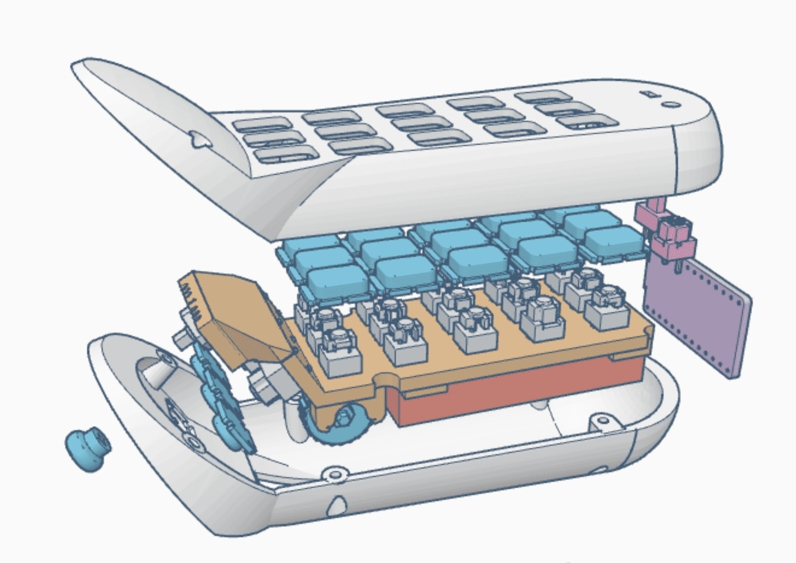

[<< 이전](../)

---

# stl 파일목록

| File          | Description | Left | Right | Total Qty |
|---------------|-------------|------|-------|--------|
| upper_L       | 좌측 상판     | 1 | 0 | 1 |
| middle_L      | 좌측 기판     | 1 | 0 | 1 |
| bottom_L      | 좌측 하판     | 1 | 0 | 1 |
| upper_R       | 우측 상판     | 0 | 1 | 1 |
| middle_R      | 우측 기판     | 0 | 1 | 1 |
| bottom_R      | 우측 하판     | 0 | 1 | 1 |
| button_upper  | 상판 버튼     | 15 | 15 | 30 |
| button_bottom | 하판 버튼     | 3 | 3 | 6 |
| wheel         | 휠          | 1 | 1 | 2 |
| joistick      | 조이스틱 커버 | 1 | 1 | 2 |
| stand         | (옵션)스탠드  | 0 | 0 | 0 |

---

[<< 이전](../)