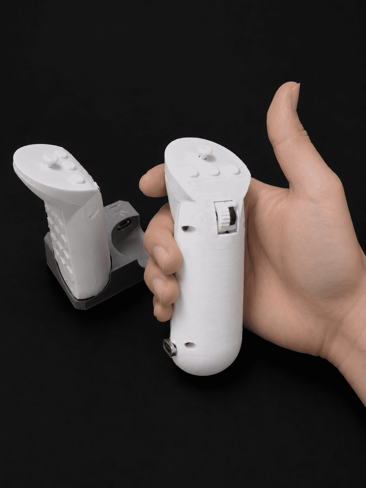

[<< 키보드 종류 보기](../../)

---

# GripKey

 

조이콘처럼 한손/양손에 쥐고 사용하는 마우스 겸 키보드 

## 1. 특징

### 1.1. 한손에 쥐고 사용가능한 가벼움과 편리성

- 한손에 쥐고 사용 가능한 크기와 무게로 제작되어 손목에 부담이 없습니다.
- 각각 1000mAh 배터리를 탑재하여 장시간 사용 가능합니다.
- 따로 키보드 위치를 고정해놓을 필요가 없어, 편한 자세로 누워서 사용하기에도 좋습니다.
- !! 한쪽 기기만 사용하여 휴대폰, 태블릿으로 웹툰/소설/쇼츠 감상용으로 사용하기에도 매우 유용합니다. !!
 
 

### 1.2. 부족함없는 키 개수와 기능
 

- 한쪽당 (5x3 +3) 18키로, 양쪽 모두 사용시 36키가 되어 일반적인 키보드의 기능을 모두 활용할 수 있습니다.
- 추가로 5방향(상,하,좌,우,클릭) 조이스틱이 탑재되어 마우스, 방향키, 스크롤등이 편하게 사용가능합니다.
- 각각 휠이 달려있어 스크롤, 음량, 밝기 조절, 확대축소 등을 빠르게 졉근할 수 있습니다.
 

### 1.3. zmk 기반
- zmk기반으로 usb연결, 블루투스 4기기 멅티페어링 등이 가능합니다.
- 동글모드, 키맵핑 수정, 매크로 등 zmk에서 지원하는 모든 기능이 커스텀 가능합니다.
- 한손만으로 사용 가능하도록 오른손을 마스터로 사용하였습니다. (zmk 수정으로 왼손 변경가능)

 
 

## 2. 제작기
[바로가기](./note/)

## 3. 필요 재료
| 이름                | 설명               | 한쪽당 수량 | 양쪽 수량 | 구매처 |
|--------------------|-------------------------|------|-------|--------|
| mcu(nrf52840)      | Nice!Nano2.0 호환 기판    | 1  | 2  | AliExpress |
| 스위치 & 리셋스위치   | 6x6x7.3mm                | 19 | 38 | 네이버스토어 |
| Row 연결용 다이오드   | 1N4148                  | 18 | 36 | AliExpress |
| 슬라이드 전원 스위치   | SS12D00 4mm             | 1  | 2  | AliExpress |
| 리튬폴리머 배터리     | TW102050 1000mAh         | 1  | 2  | 디바이스마트 |
| M2 십자 볼트         | M2 5mm                  | 6  | 12 | 네이버스토어 |
| M2 인서트 너트       | M2 3mm (외경 2.81mm)     | 6  | 12 | AliExpress |
| 5방향 스위치(조이스틱) | 7x7x6mm (대각선방향 스틱)  | 1  | 2  | AliExpress |
| 휠- 로터리 인코더     | Kailh 5mm 마우스 인코더   | 1  | 2  | AliExpress |
| 휠- MR63 베어링     | MR63 3x6x2mm            | 1  | 2  | AliExpress |
| 휠- M3 기둥         | M3 6mm 원형 샤프트        | 1  | 2  | AliExpress |
| 마그네틱 커넥터       | (대체가능)셀인스텍 PD-I100W | 1  | 2  | 네이버스토어 |
| AWG30 케이블        | 전선 연결용                | 0  | 1  | 디바이스마트 |

!! 상단의 재료 기준은 최소 수량입니다. 여유있게 구매하는걸 추천드립니다. !!

## 4. 모델링 파일
3d 프린터로 출력할 수 있는 .stl 파일입니다. 
[바로가기](./stl/)

## 5. 펌웨어(zmk)
ble(저전력 블루투스)를 지원하는 zmk를 이용하여 만들었습니다. 
[바로가기](https://github.com/maga32/GripKey-config)

## 6. 갤러리
[바로가기](./images)

---

[<< 키보드 종류 보기](../../)
