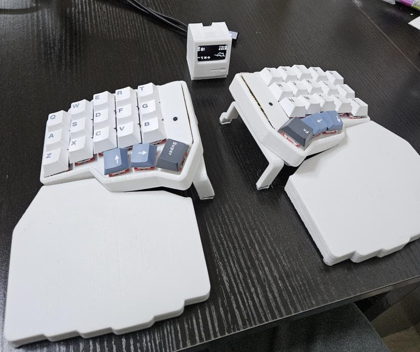
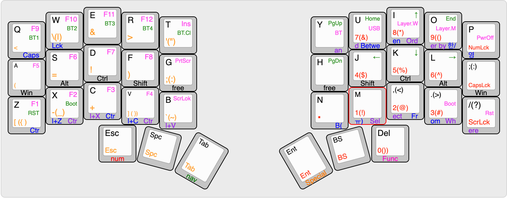

[<< 키보드 종류 보기](../../main)

---
# corne35
3x5배열 corne 키보드에 무선, 동글모드, 텐팅, 팜레스트 등을 제 입맛대로 적용한 키보드 입니다. 

---

## 1. 특징

#### 1.1. 더스트커버 겸 팜레스트 겸 이동시 하드케이스
- 전용 더스트 커버를 만드는 김에 팜레스트로 활용할 수 있도록 제작하였습니다. 

 
 
#### 1.2. 자석을 활용한 텐팅시스템
- 네오디뮴 자석을 활용해 간단하게 키보드 각도를 조절할 수 있습니다. 

 
 
#### 1.3. 동글을 이용한 무선활용
- 동글 디스플레이를 활용해 블루투스, 동글모드를 오갈 수 있으며 귀여움까지 챙겼습니다. 

 
 
#### 1.4. 개발에 적합한 키매핑
- 적은 수의 키로도 개발에 불편하지 않도록 콤보키 적용 및 개발자용 특수문자 레이어를 따로 배치하였습니다. 

 
 

---

## 2. 제작기
[바로가기](./note/)

---

## 3. 모델링 파일
3d 프린터로 출력할 수 있는 .stl 파일입니다. 
[바로가기](./stl/)

---

## 4. 펌웨어(zmk)
ble(저전력 블루투스)를 지원하는 zmk를 이용하여 만들었습니다. 
[바로가기](https://github.com/maga32/corne35-config)

### 4.1. 사용법
1. 위 펌웨어 링크 바로가기의 Actions 탭에 들어가셔서 
   main  브랜치의 초록 체크표시가 된 목록중 제일 위의 목록(최신)을 클릭합니다.

2. 아래의 firmware 파일을 받으시고 압축을 풀어줍니다.

3. 동글, 우측, 좌측 mcu에 각각 아래의 파일을 업로드 해주시면 사용 가능합니다.
    - corne35_dongle dongle_display-nice_nano_v2-zmk.uf2
    - corne35_right-nice_nano_v2-zmk.uf2
    - corne35_left-nice_nano_v2-zmk.uf2

### 4.2. zmk 수정, 빌드 방법
원하는 방식으로 키맵 등을 수정하거나 빌드하고 싶으신 분들은 
[zmk공식문서](https://zmk.dev/docs) 를 참고하시어 
위 펌웨어 링크를 포크해가신 후 작업하시면 됩니다. 

---

## 5. 기본 키맵

 
 
기본 키맵은 다음과 같습니다. 
 
'a s d f  j k l ;' 키를 홈로우모드(꾹 누르고 있으면 모디키로 작동) 사용하였으며 
CapsLock, 한/영, 우측ㅠ키 등은 동시에 누르면 작동하는 콤보키를 사용하였습니다. 
 
그 외의 콤보키들은 사진으로 확인해주시면 되고 사진상 나와있지는 않지만 
z+x+c 는 Ctrl+Shift+Z 로, c+v+b 는 Ctrl+Alt+V 로 작동합니다. 

---

[<< 키보드 종류 보기](../../main)
