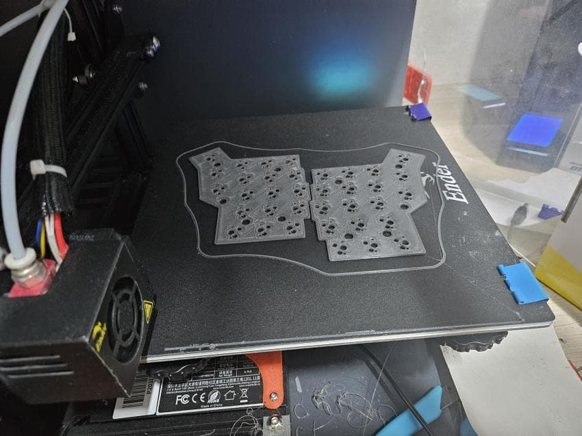
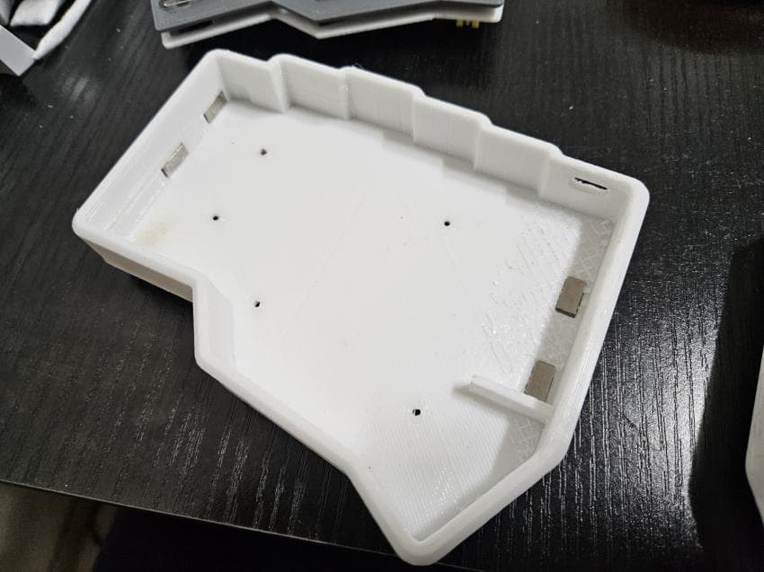
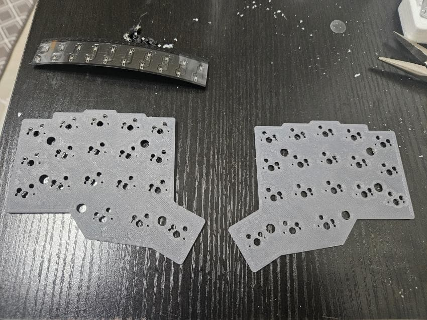

[<< 이전](../)

---
안녕하세요 
 
오늘은 얼마 전부터 관심이 생긴 3x5 corne를 만들어보았습니다. 
만드는 김에 다른 자작하시는 분들께도 참고가 될 수 있도록 제작기를 작성하였습니다. 

 
 
1 . 원하는 키보드 레이아웃 사이트에서 원하는 키보드 레이아웃을 작성합니다. 
https://www.keyboard-layout-editor.com/#/gists/401353e87866e83c71679da83a5be8cf  
저는 corne 기반의 36키 키보드를 만들 예정입니다. 
몇번 테스트해본 결과 제가 줄일 수 있는 마지노선의 키 숫자였습니다. 
가장 바깥쪽 썸키는 1.25u로 제작하였습니다. 

 
 
2. Raw data 탭에 나온 데이터를 복사한 후 아래 사이트에 붙여넣고 
만들어지는 보강판의 모델링 .stl 파일을 다운받습니다. 
https://www.keyboardcad.com/  

 
 
3. 만들어진 보강판을 바탕으로 모델링을 해줍니다. 
저는 thinker cad가 가장 편해서 해당 웹ui상에서 모델링 해주었습니다. 

 
 
4. 해당 파일들을 3d 프린터로 출력해줍니다. 
저는 20년경 구매한 ender-3 기본 모델을 사용중입니다. 

 
 
5. 하판에 네오디뮴 자석을 순간접착제로 붙입니다. 
자석은 텐팅스탠드를 세우고 보관할 용도입니다. 
(사실 이후에 몇번의 수정과정이 있었지만 첫트라이에 찍어놓은 사진만 있어서 이 사진으로 썼습니다.) 

 
 
6. 흡음을 위해 바닥면 흡음재를 깔아줍니다. 
해당제품은 비접착 신슐레이터 5t입니다. 

 
 
7. 바닥면의 미리 파놓은 홈에 다이소 유리 미끄럼방지 패드를 붙입니다. 

 
 
8. 보강판에 m2 인서트너트를 박아넣습니다. 
인서트너트의 외부직경과 딱 맞는 구멍을 만들어주고 인서트너트를 달군 인두기로 밀어넣으면 튼튼하게 고정됩니다. 

 
 
9. 보강판과 기판 사이에 들어갈 포론 흡음재를 잘라서 넣어줍니다. 
최대한 깔끔하게 하고 싶었는데 자를때마다 밀리고 뭉게져서 저정도가 최선이었습니다 ㅠ ㅠ... 

 
 
10. 핸드와이어링을 위한 더미 기판입니다. 

 
 
11. 해당 기판에 다음과 같은 배치로 선을 연결해줄 예정입니다. 
아래면에서 납땜할거라 좌우 반전상태입니다. 
좌우 키보드 mcu는 슬레이브, 가운데 동글 mcu를 마스터로 만들었습니다. 

 
 
12. 먼저 합스왑 소켓을 모두 순간접착제로 붙인 후 
다이오드를 구부려 행끼리 납땜해줍니다. 
다이오드는 여러 키를 눌렀을때 누른 키만 정확하게 입력되도록 전류가 흐르는 방향을 고정해주는 역할이며, 
다이오드의 검은 선 부분이 모두 아래를 향하도록 남땜해야합니다. 

 
 
13. 열끼리도 모두 납땜해 줍니다. 
mcu와 모든 행, 열을 배치대로 연결해 주고, 
리셋버튼(RST, GND)과 배터리(B-, B+)도 mcu에 납땜해줍니다. 
배터리는 케이스 모양을 상하좌우로 늘리지 않으면서 욱여넣을수 있는 가장 큰 모양으로 골랐습니다. (50x20x10 - 1000mah) 

 
 
14. 각 파트들이 완성됐으면 조립해줍니다. 
(청축은 나중에 황축으로 교체했습니다.) 

 
 
15. 키캡을 꽂고 아랫면에 m2 나사까지 박으면 진짜 완성입니다. 

 
 
16. 완성된 파트들입니다.
- 동글 x1 (사진 찍을때 빼먹었네요..)
- 키보드 x2
- 키보드 텐팅다리 x2 (자석과 미끄럼방지 패드 접착)
- 더스트커버 겸 팜레스트 겸 하드케이스 x2 (다이소 미끄럼방지 패드 접착)

 
 
17. 기본 상태입니다. 
보통 퇴근시에 더스트커버를 덮어놓는데, 자작 키보드니만큼 커버도 자작으로 만들어야 했습니다. 

 
 
18. 하지만 더스트커버를 더스트 커버로만 사용하기엔 아까우니 팜레스트로도 활용할 수 있도록 만들었습니다. 

 
 
19. 더스트커버 / 팜레스트 / 이동시 하드 케이스 총 세가지 용도로 활용이 가능합니다. 

 
 
20. 팜레스트의 활용도에 맞게 경사도 줬습니다. 

 
 
21. 텐팅용 다리입니다. 
네오디뮴 자석을 활용해 평소에는 키보드 좌우에 거슬리지 않도록 붙여놨다가 
하판에 붙여 각도를 조절할 수 있도록 만들었습니다. 
몇번의 테스트 끝에 12~12.5도 정도가 제일 편한 것 같아서 이 각도로 만들었습니다. 

 
 
22. 풀 셋팅된 상태입니다. 

 
 
25. 마스터 역할인 동글입니다. 

 
 
26. 동글의 기능은
    - 마스터 역할을 수행하여 슬레이브인 좌우 키보드들의 배터리를 아껴줍니다.
    - 타키보드에서의 2.4g 동글 역할로, 블루투스가 안되는 컴퓨터에 동글만 꽂으면 무선 키보드로 활용 가능합니다.
    - 타자 입력시 귀여운 봉고캣이 책상을 두드립니다.
    - 배터리 잔량을 표기해줍니다.
    - usb, 블루투스 출력을 표기합니다.
    - 레이어명, 캡스락, 넘버락, 스크린락 및 누른 모디키를 표시합니다.
   

 
 
27. 마무리하며 
키보드를 자작하다보니 점점 36키를 써보고 싶다는 생각이 들어 만들어봤습니다. 
고민을 많이 하고 제가 필요한 기능들을 하나하나 넣으며 재밌게 만들 수 있었습니다. 
 
텐키리스 일반 키보드 -> 36키 컬럼스태거 스플릿 
으로 노빠꾸로 넘어오다보니 적응이 힘들지 않을까 걱정했는데 
저한테 맞는 키배열, 각도, 모양등을 고민하고 수정하면서 자작을 하다보니 
의외로 쉽게 적응할 수 있었습니다. 
 
특히 개발을 하는 입장에서 키맵에 관련하여 배열 고민을 제일 오래 했는데, 
원하는 배열이 잘 나온 것 같아 만족스럽습니다. 
 
+) 예를 들어 저는 가장 많이 쓰지만 그렇기에 은근히 귀찮은 sql문 문장들을 콤보키로 넣었습니다. (1번 사진에서 키맵 확인가능) 
그리고 개발에서 쓰이는 특수문자들도 따로 레이어로 만들어 넣었습니다. 

 
 
앞으로 회사에서는 이 키보드로 정착해서 쭉 쓸 예정입니다. 
다만 동료분들이 제 자리에 와서 사용할 용도의 키보드도 따로 하나 놔야겠네요 
 
긴 글 읽어주셔서 감사드리고 
다음엔 집에 침대에 누워서 가슴팍이나 배에 올리고 쓸 수 있는 키보드를 만들어볼 예정입니다 
 
모두들 즐거운 키보드 생활 하세요~ 
 
---
[<< 이전](../)
