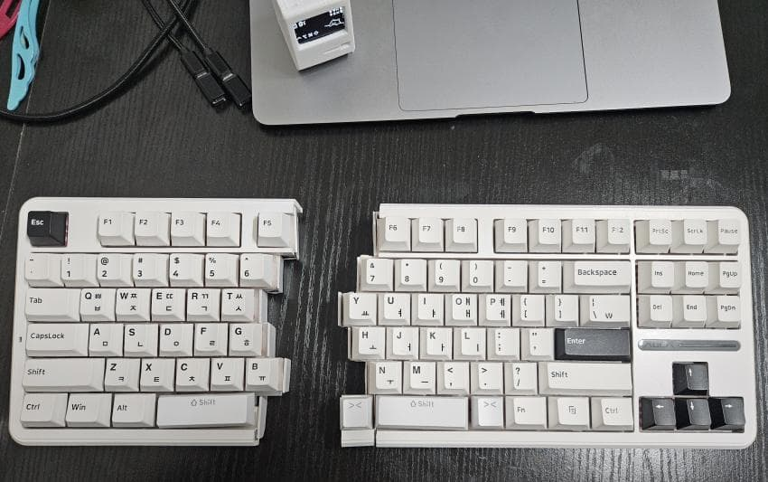

[<< 메인](../peachKB)

---
# peachKB-MK-II

결론적으로 peachKB-MK-II 는 하드웨어 퀄리티가 다소 떨어지는 면이 있어 
펌웨어만 공개하기로 하였습니다.

---

## 1. 제작기
1편 유선버전 제작기와 이어지는 내용이라 
1편을 보지 않으신 분은 순서대로 봐주시면 감사합니다. 
[1편 보기](../peachKB/note) 
[2편 보기](./note/)

---

## 2. 펌웨어(zmk)
ble(저전력 블루투스)를 지원하는 zmk를 이용하여 만들었습니다. 
[바로가기](https://github.com/maga32/peachKB-zmk-config/tree/dongle-mode)

### 2.1. 사용법
1. 위 펌웨어 링크 바로가기의 Actions 탭에 들어가셔서 
dongle-mode 브랜치의 초록 체크표시가 된 목록중 제일 위의 목록(최신)을 클릭합니다.

2. 아래의 firmware 파일을 받으시고 압축을 풀어줍니다.

3. 동글 디스플레이를 시용하실 분은 (동글 메인)
   - peachKB_dongle dongle_display-nice_nano_v2-zmk.uf2
   - peachKB_right-nice_nano_v2-zmk.uf2
   - peachKB_left-nice_nano_v2-zmk.uf2 

    을 각각 동글, 우측, 좌측 mcu에 업로드 해주시고,

4. 동글을 사용하지 않으실 분은 (우측 메인)
   - peachKB_center_right-nice_nano_v2-zmk.uf2
   - peachKB_left-nice_nano_v2-zmk.uf2

    을 각각 우측, 좌측 mcu에 업로드 해주시면 사용 가능합니다.

### 2.2. zmk 수정, 빌드 방법
원하는 방식으로 키맵 등을 수정하거나 빌드하고 싶으신 분들은 
[zmk공식문서](https://zmk.dev/docs) 를 참조하시어 
위 펌웨어 링크를 포크해가신 후 작업하시면 됩니다. 

---
[<< 메인](../peachKB)