[<< 이전](../)

---
안녕하세요. 
 
요전에 B키가 탈부착 되는 스플릿 키보드를 만들어 후기를 올렸습니다. 

처음은 만족스럽게 사용했지만 사용하며 차차 아쉬운 점이 보이기 시작하였습니다. 
1. 스플릿으로 합쳤다 분리했다 하는 부분의 락카 도색이 점점 벗겨집니다.
2. B키에 자석을 추가하기위해 너무 높은 높이로 만들었습니다.
3. 무선(블루투스) 기능이 절실합니다. 다른기기 연결시마다 선을 바꿔끼는게 귀찮았습니다.

그래서 Mk2 버전을 만들려고 생각하던 도중 기가 막힌 생각이 떠오릅니다. 
 
이럴거면 그냥 외관이 깔끔한 기성품을 반으로 자르는게 낫지 않나? 
(그러지 말았어야 헸는데...) 
 
그래서 바로 실행에 옮기게 됩니다. 
 
 
1. 오늘의 희생양은 제가 제일 좋아하는 f87 pro 입니다. 
아래 사진에서 pcb를 제외한 모든 내용물을 반으로 자를 예정입니다. 

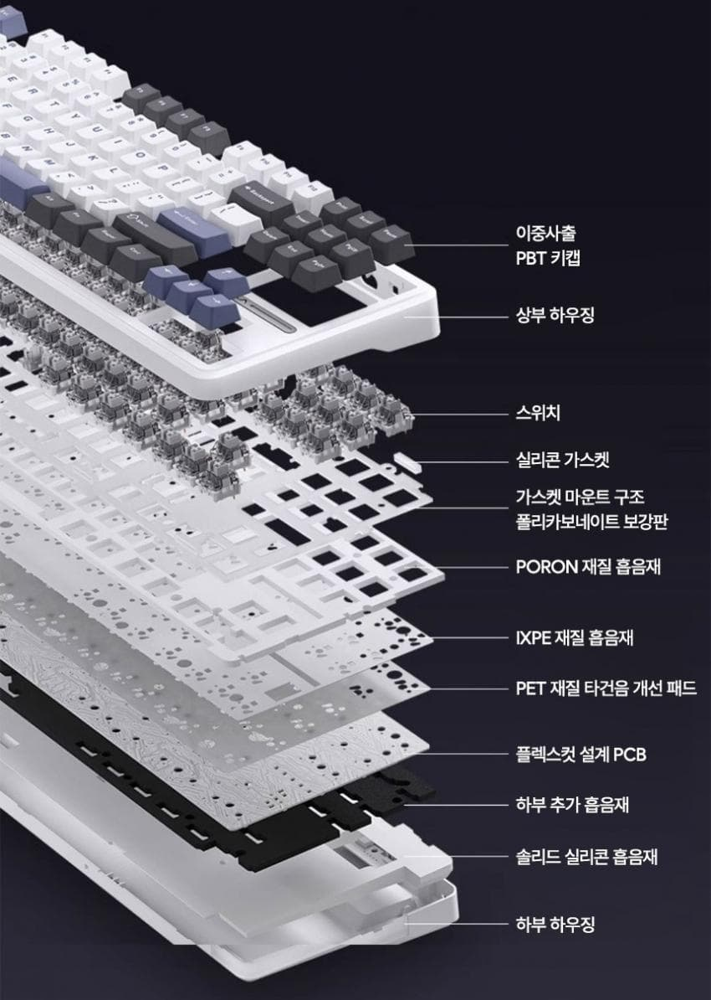
 
 
2. 우선 하우징을 벗겨놓고 간을 봅니다. 

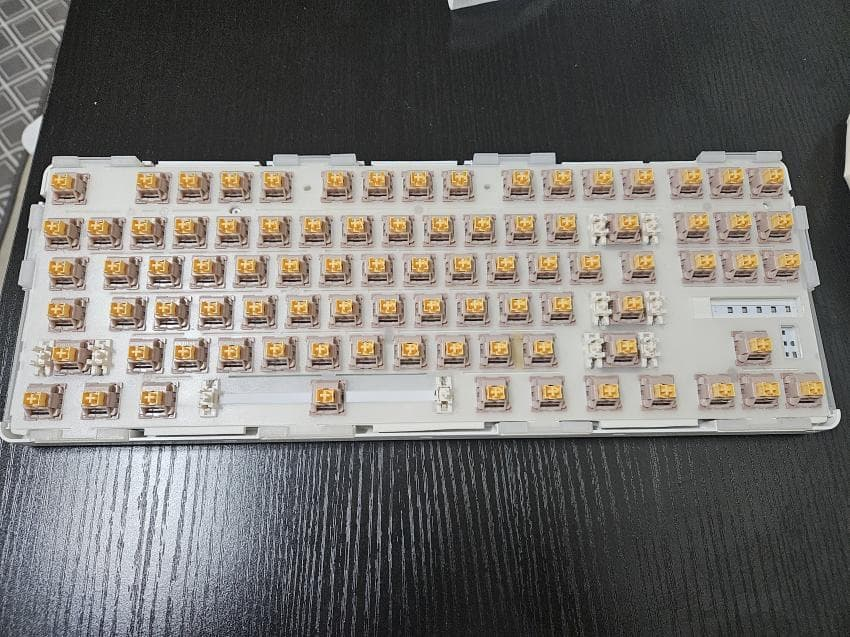
 
 
3. 쓸땐 몰랐는데 일반 키보드보다 간격이 미묘하게 좁습니다. 
몇번씩 조정해가며 맞는 간격을 찾아냅니다. 

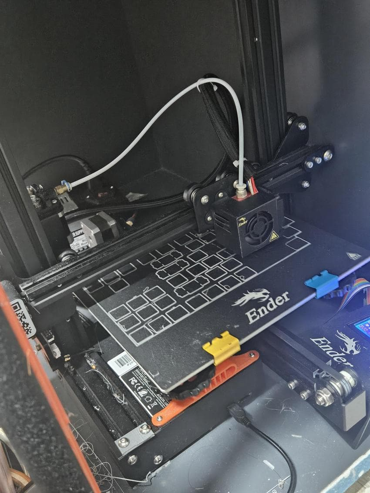
 
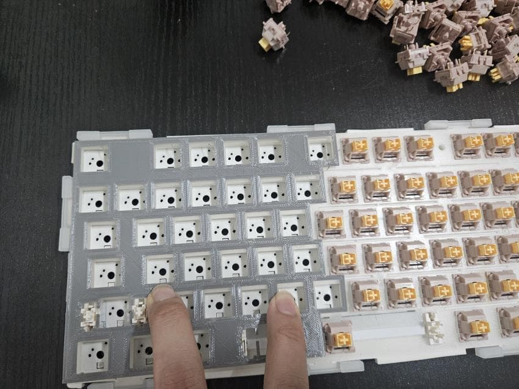
 
 
4. 간격을 맞췄으면 더미용 pcb를 냅다 출력합니다. 
보강판은 기존 것을 잘라 쓸것이기 때문에 따로 출력할 필요가 없습니다. 

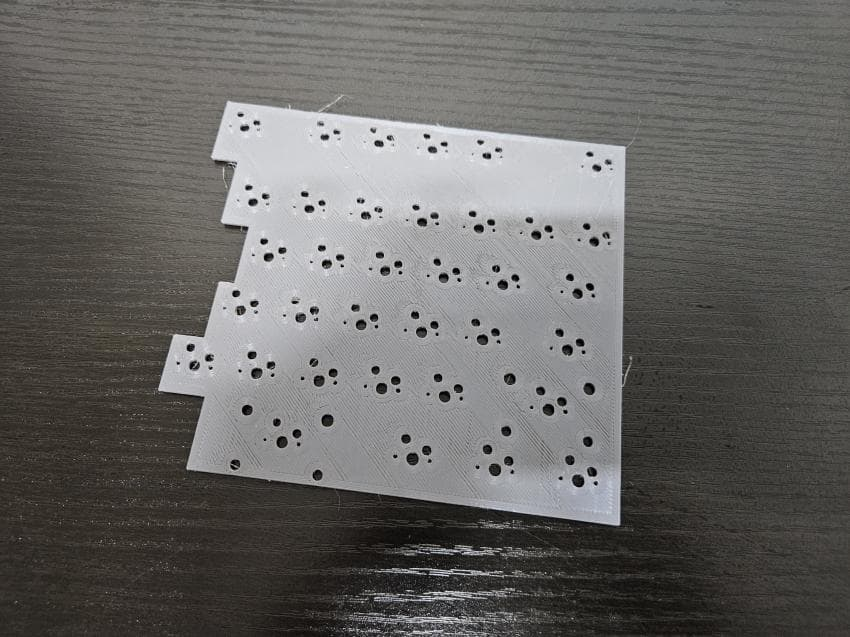
 
 
5. 키보드의 메인 두뇌인 mcu는 일명 짭나노라고 불리는 NRF52840 Supermini 3개입니다. 
각각 좌측, 우측, 동글에 들어갈 예정입니다. 
동글을 제외하면 mk1때와 매트릭스상 크게 변화된 점은 없습니다. 
(키보드 밑면에서 작업해야하기 때문에 좌우가 반전되어있습니다) 

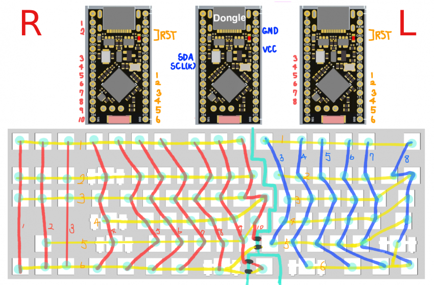
 
 
6. 이것은 동글에 들어갈 1.3인치 화면입니다. 
매킨토시 클래식 케이스를 출력하여 화면을 넣을 예정입니다. 
동글과 관련된 추가 내용은 아래쪽에 후술하겠습니다.

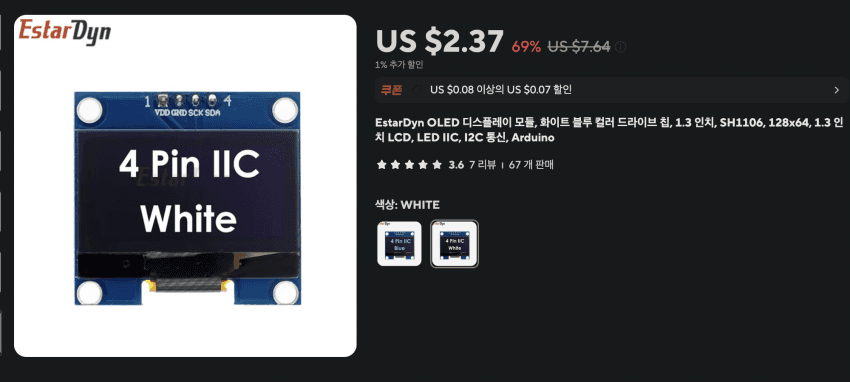
 
 
7. 이제 매트리스대로 핫스왑소켓을 접착제로 붙인 후 납땜해줍니다. 

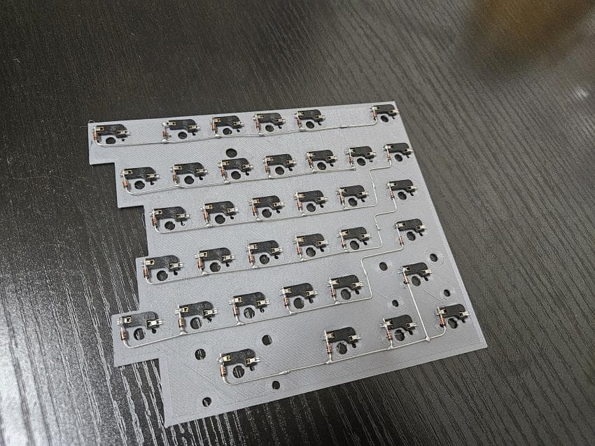
 
 
8. 반대쪽도 작업해줍니다. 
높이를 낮춰야하기 때문에 자석을 기판 바로 아래에 넣으려고 N키의 스위치는 90도 틀어서 디자인하게 되었습니다. 

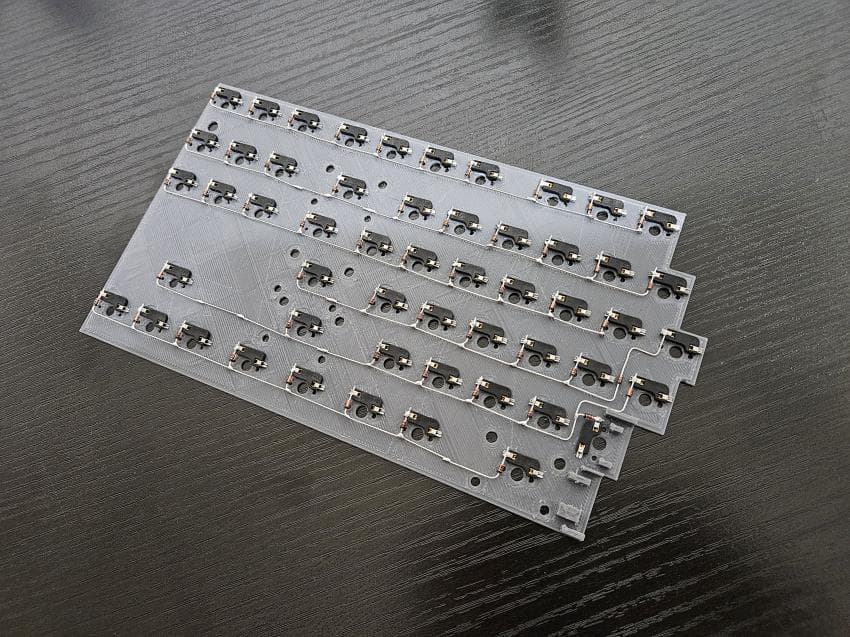
 
 
9. 상판과 흡음재들을 반갈죽 해줍니다. 

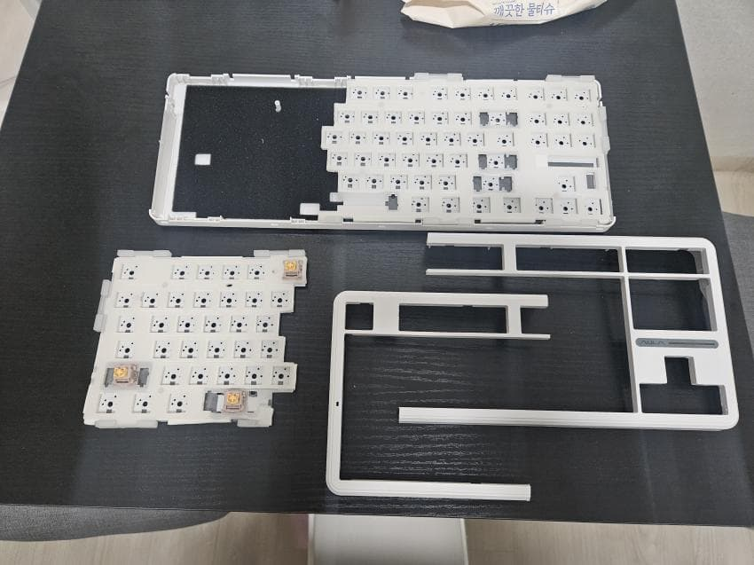
 
 
10. 남은 하판도 반갈죽..! 
이때즈음 느낀건 다신 이런짓 하지 말아야지... 였습니다. 
칼과 다이소 톱으로 자르니 영 삐뚤빼뚤하게 되고 
힘들고 고된 작업이었습니다. 

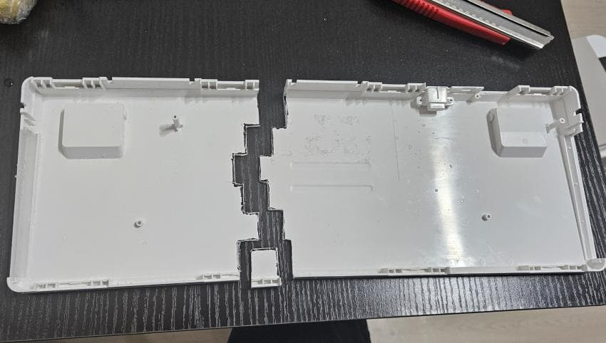
 
 
11. 배터리는 우측은 기존에 독거미에 달려있던 배터리(4000mah)를 재활용했고 
좌측은 적당한 크기를 찾다가 3150mah를 달아주었습니다. 

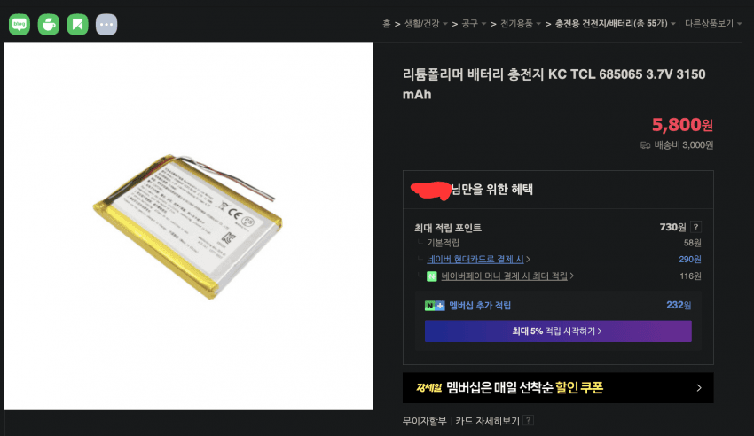
 
 
12. B키가 연결될 포고핀과 자석 부분입니다. 

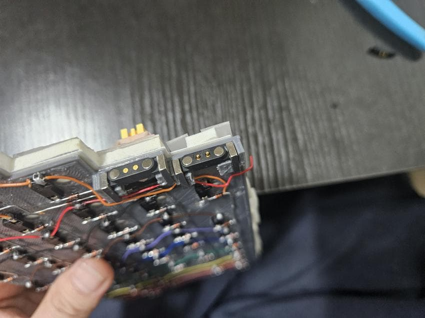
 
 
13. 분리되는 B키입니다. 

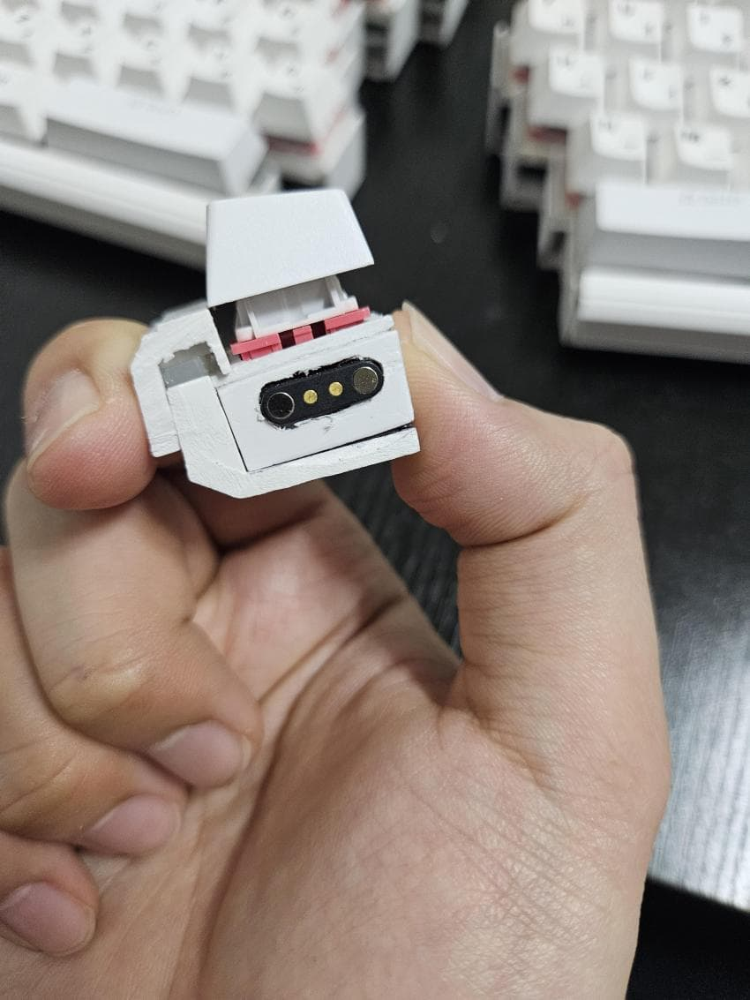
 
 
14. 옆의 단면은 1t짜리 포맥스를 붙여 막아주었습니다. 

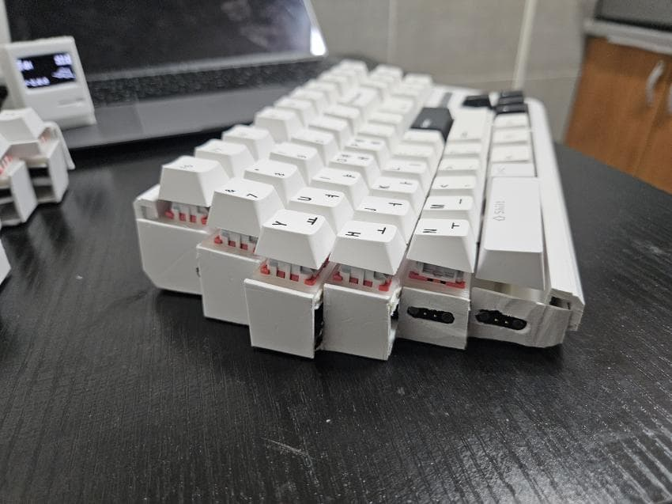
 
 
15. 자석으로 B키가 잘 붙네요 

 
 
16. 이번 작업에서 제일 아쉬운 점이 있다면 키보드를 합쳤을 때, 포맥스의 두께만큼 가운데 단차가 발생했다는 점입니다. 
물론 사포로 맞춰서 다 갈아내면 되겠지만, 이미 케이스를 자르는 시점부터 너무 힘들었기에 이번 작업은 이정도로 마무리하고 사용할 예정입니다. 

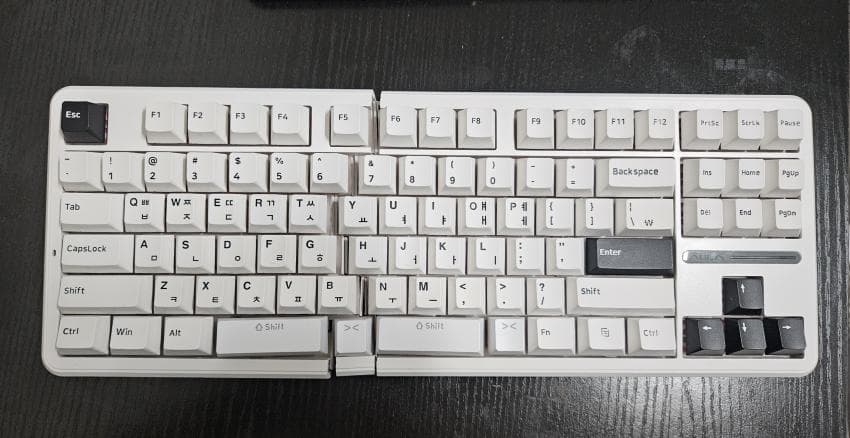
 
 
17. 마지막으로 동글입니다. 

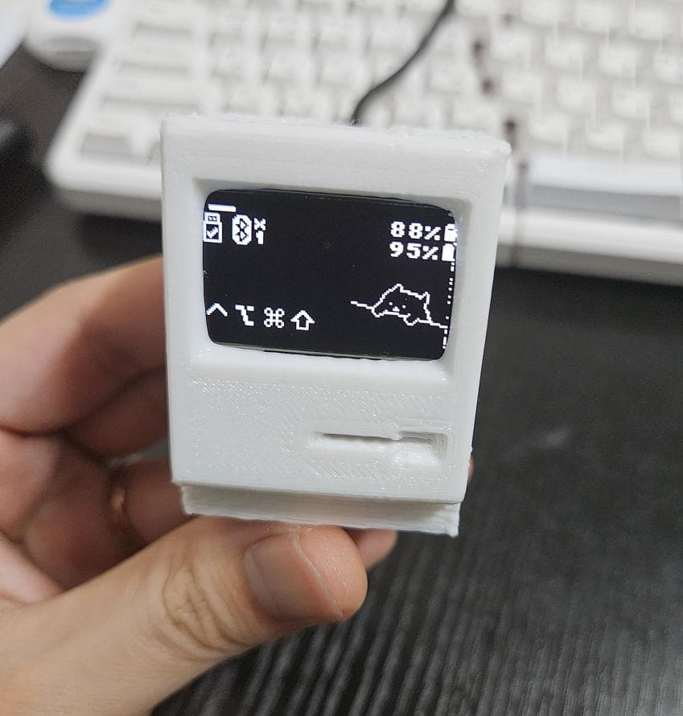
 
 
18. 동글모드는 키보드의 마스터를 동글로 잡고 
2.4g키보드처럼 동글을 usb로 연결하여 사용하거나, 블루투스로 연결하는 방식입니다. 
 
이쪽 링크에서 적용해보실 수 있으며 
https://github.com/englmaxi/zmk-dongle-display  
아래와 같은 기능들을 추가하실 수 있습니다. 

- 타자입력시 커여운 봉고캣이 책상을 두드립니다.
- 캡스락, 넘버락, 스크린락 표기
- 누른 모디키 표시
- 레이어명 표기
- 출력표기(usb, 블루투스)
- 배터리 잔량 표기

 
 
며칠 사용해본 결과 동글모드의 장단점은 
 
+장점
1) 상시전원을 받는 동글이 마스터가 되어 슬레이브쪽인 키보드의 배터리가 오래간다
2) 블루투스가 없는 환경(회사 컴퓨터) 등에서도 키보드를 무선으로(2.4g 키보드처럼) 활용할 수 있다.
3) 봉고캣이 귀엽다

-단점
1) mcu값이 하나 더 들어간다.
2) 동글이 마스터이기 때문에 블루투스를 쓰고싶더라도 동글이 어딘가에는 꽂혀있어야 한다(하다못해 보조배터리에라도) 

정도입니다. 
 
 
19. 급 마무리하며 

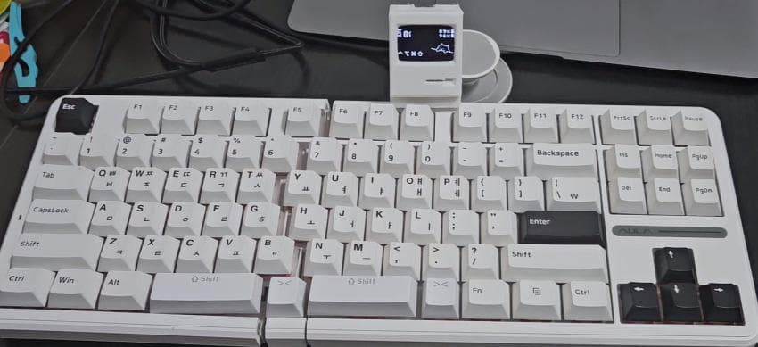 
 
이번 키보드는 생각처럼 깔끔하게 작업되지 않아 아쉬움이 남네요. 
B키분리 키보드에 관한 자세한 내용들은 이전 글에 더 상세히 적어놨으니 
그 글을 참고하시면 좋을 것 같습니다. 
 
최근에는 컴팩트한 사이즈에 관심이 생겨 3x5 corne 작업중입니다. 
 
긴 글 읽어주셔서 감사드리고 
조만간 또다른 키보드 후기로 찾아뵙겠습니다. 

---
[<< 이전](../)
