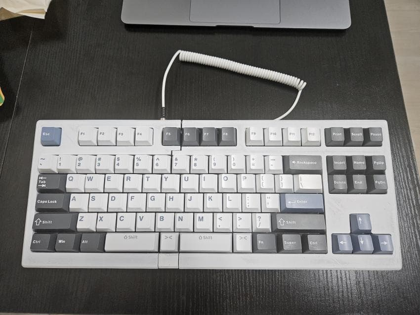

[<< 키보드 종류 보기](../../main)

---
# peachKB
합쳐서도, 분리해서도 쓸수도 있는 <b><i><u>한국형</u></i></b> 스플릿 키보드입니다.

---

## 0. 어떤점이 한국형인가 ?
대다수의 한국인들은 'b'를 입력할때는 왼손 (black) 
'ㅠ'를 입력할때는 오른손으로 입력하는 경향이 있지만 (아이유) 
 
대다수 스플릿 키보드는 우측에 ㅠ키가 없거나, 
있는 경우엔 깔끔하게 하나의 키보드처럼 합쳐지지 않습니다. 
 
이것을 해결하기 위해 우측 ㅠ키를 스페이스 탈착식으로 만들어 
스페이스바 자리에 보관할 수 있도록 만들었습니다. 
 
 
 
또한 위 영상에서와 같이 스페이스 자리에선 스페이스키로, 
N옆에서는 B키로 작동되도록 설계했습니다.

---

## 1. 제작기
[바로가기](./note/)

---

## 2. 모델링 파일
3d 프린터로 출력할 수 있는 .stl 파일입니다. 
[바로가기](./stl/)

---

## 3. 펌웨어(kmk)
python 코드를 사용하는 kmk를 이용하여 작성하였습니다. 
[바로가기](./code/)

---

## + 무선버전 (bluetooth / dongle / zmk)
[바로가기](../peachKB-MK-II)

---

[<< 키보드 종류 보기](../../main)
