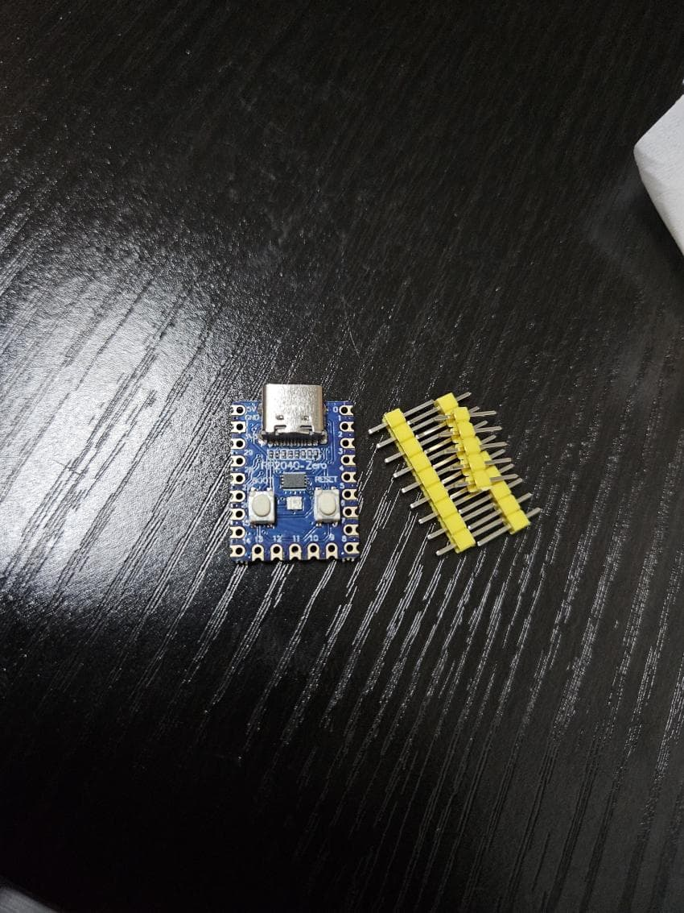

[<< 메인](../)

---
## - Intro.

하루종일 키보드 치는게 직업이다보니 허리가 너무 아프고 어깨가 안으로 굽는것 같아 
스플릿 키보드에 관심이 생겼습니다 
 
제가 원하는 키보드는 텐키리스 배열에 
좌우로 분리되어 손을 가운데로 모아치지 않아도 되고 
합치면 다시 일반키보드같아져서 다른 직원이 제 자리에 와도 평범하게 쓸 수 있는 키보드를 원했습니다. 
 
가장 문제는 B키였습니다. 
한국인들의 대부분은 B키(ㅠ키)를 칠때 영어 입력시 왼손을 사용하고 (ex. black) 
한글 ㅠ를 입력할때는 오른손을 사용합니다 (ex. 아이유) 
 
그래서 오른쪽에도 B키가 필요한데 B키가 두개면 키보드를 합칠때 튀어나온 부분이 겹쳐지니 
우측에 탈착이 가능한 B키가 있는 스플릿 키보드가 필요했습니다. 
 
이런 조건의 제품이 당연히 기성품중엔 없으니 만들어야겠다는 생각이 들었습니다, 
 
키보드 제작은 처음이라 여러 글과 동영상을 교보재삼아 공부했습니다. 
아래 내용들을 읽어보시면 저처럼 처음 도전하는 분들이라도 
충분히 키보드 하나를 제작할 수 있을만큼 자세히 글이 써있습니다. 
 
- MC유신님의 글 : 전반적인 키보드 제작과정이 모두 적혀있습니다. 제일 큰 도움이 되었습니다. 
https://gall.dcinside.com/mgallery/board/view/?id=mechanicalkeyboard&no=830197
  
- Resoluxe님의 글 : 스플릿 키보드 제작에 관한 많은 내용이 담겨있습니다. 
https://wikidocs.net/book/9749
  
- TeleV2님의 5편짜리 영상 : 키보드 하우징의 규격이나 사이즈 등을 자세히 알려줘서 모델링을 하는데 큰 도움이 되었습니다. 
https://www.youtube.com/watch?v=pLELhPSFD6w
  

---

## - Main.

1. 아래의 사이트에서 자신이 원하는 키보드 배열을 직접 보면서 만들어봅니다.
http://www.keyboard-layout-editor.com/#/gists/9254aae1a83dad323215be446c1d209e
 처음에 배열은 머릿속에만 있으면 되지 하고 생각했었는데 
실제로 모델링 만들면서 이 기반이 정말 중요한 작업이었습니다. 

 
 

2. 위 사이트의 Raw data 탭에 있는 정보를 복사해 아래의 사이트에 붙여넣어줍니다.
https://www.keyboardcad.com/
 그러면 자동으로 보강판 stl파일을 생성해줍니다. 
저는 Plate Border Width : 1mm / Grid Spacing : 19mm 로 선택했습니다. 

 
 

3. 위 보강판 사진을 스크린샷 해서 좌우 반전한 후(납땜작업은 바닥쪽에서 해야하기 때문에) 
그 위에 자신이 작성할 키보드 매트릭스를 작성해봅니다. 
기본적으로 저는 스플릿으로 만들 예정이라 rp2040 zero 보드 2개를 사용했습니다. 
 
키보드 매트릭스는 회로를 연결할 가로x세로 라인을 만들고 
각 가로줄과 세로줄이 두번이상 겹치지만 않게 작성하면 됩니다. 
예를들어 오른쪽 키보드(아래 이미지상에서는 반전이라 왼쪽)에서는 가로 6라인, 세로 10라인을 사용하였으니 
최대한 할당 가능한 키의 수는 6x10 으로 60키입니다. 
 
보드의 GND, 3V, 29번홀은 aux단자로 서로 연결할 예정입니다. 

 
 

4. 사용할 주요 재료들입니다. 
 
핫스왑소켓 - 키보드의 스위치 대신 납땜해서 편하게 스위치를 갈아낄 수 있게 해줍니다. 

 
 
rp2040 zero - 키보드의 메인보드입니다 좌우 총 2개 있습니다.

 
 
다이오드 - 전류가 한방향으로만 흐르게 하여 여러키를 눌러도 누른키만 인지하도록 해줍니다. 
스위치 1개당 하나씩 필요합니다. 

 
 
무보강 스태빌라이저 - 보강판이 아닌 기판에 끼우는 스태빌라이저입니다. 

 
 

5. 해당 재료들의 측정값을 기반으로 
3d프린터로 샘플을 출력하여 결합해보며 오차를 잡았습니다. 

 

 
 

6. 본격적인 모델링작업을 진행합니다. 
역시 저는 틴커캐드가 제일 간단하고 편한것 같습니다. 

 
 

7. 모델링을 기반으로 출력을 합니다. [>> 출력용stl파일](../stl/) 
고속프린터가 아니라 Ender3라서 출력시간이 오래 걸리는 관계로 모든 출력물은 0.28 높이로 출력했습니다. 

 
 

8. 좌측 더미기판을 설계한대로 납땜합니다. 
- 핫스왑소켓은 순간접착제로 더미기판에 접착합니다. 

 
 
- 가로라인은 다이오드를 이용하여 연결합니다. 다이오드의 검은줄이 아래로 향하는 방향으로 납땜했습니다. 
한줄씩 미리 다리를 구부려놓으면 실수로 위아래를 뒤집어 붙이는 일이 일어나지 않습니다. 

 
 

- 세로줄은 래핑와이어를 인두기로 지져 피복을 녹여가며 납땜했습니다. 
색깔별로 연결하면 꼬아서 한번에 선을 모아도 보드에 연결시에 어느라인인지 알 수 있어 편합니다. 

 
 

9. 우측 더미기판도 납땜해줍니다. 

 
 

- aux단자(PJ-325)는 양쪽 동일하게 그림과같이 연결해줍니다. 
일반적인 3.5mm 3단자 aux를 연결할 예정입니다(trs) 

 
 

10. 좌측 보강판, 상판, 하판입니다. 

 

 

 
 

11. 상판의 구멍들마다 m2용 인서트를 인두기로 눌러 넣어서 나사가 결합될 수 있게 해줍니다. 

 
 

12. 탈착 가능한 B키입니다. 
네오디움 자석과 자석포고핀을 삽입하여 
실사용시 흔들리지 않고 강력하게 연결될 수 있도록 만들었습니다. 

 

 

 
 

13. 조립시 전체적인 느낌은 이렇게 될것입니다. 
우측 하판이 커서 한번에 출력이 가능할지 걱정됐는데 
ender3에서 아슬아슬하게 한번에 출력 가능한 사이즈였습니다.(232.69mm) 
 
우측 하판에도 네오디움 자석과 포고핀이 
N(ㅜ)키의 왼쪽과 스페이스바의 왼쪽에 들어갈 예정입니다. 

 
 

14. 대망의 합체입니다. 
결합이 잘 되나 먼저 테스트를 해보고 잘 된다면 도색을 진행한 후 
흡음을 위해 신슐레이터를 잘라서 하판에 깔고 M2나사를 이용해 결합하면 

 

 

 

 
 

15. 완성입니다. 

 

 
 

### ++ 가장 중요한 기능 ! ! ! !
B키 탈부착입니다. 
스페이스 옆에 붙을땐 스페이스로 인식하고 
N키 옆에 붙을땐 B키로 인식하여 작동합니다. 

 
 
키보드 펌웨어는 Python 언어를 이용하는 kmk를 사용했습니다. 
[>> 코드보기](../code)
 

---
## - Outro.
 
만들면서 다음에는 좀 더 잘 할 수 있을것 같은 부분들이나 
개인적으로 아쉬운 부분들이 있긴 하지만 
원했던 기능들은 모두 들어가 있어서 꽤나 만족스럽게 사용할 수 있을 것 같습니다. 
 
긴 글 읽어주셔서 감사합니다! 
모두들 즐거운 키보드생활 하세요~ 

---
## - 부품 비용 및 구매처.
 

| 재료                                  | 비고                                                          | 구매처                                                                                                                                                                                                                     | 가격+베송비               |
|:------------------------------------|:------------------------------------------------------------|:------------------------------------------------------------------------------------------------------------------------------------------------------------------------------------------------------------------------|:--------------------------|
| 컨트롤러 x2                             | rp2040 zero                                                 | [링크](https://smartstore.naver.com/ds-parts/products/10062640388?nl-au=d806b03afbf6468786d500778476e21f&NaPm=ct%3Dlzp3uqoa%7Cci%3Dcheckout%7Ctr%3Dslsl_myc%7Ctrx%3Dnull%7Chk%3D5300116522bffdb957d8909901bc27481e61a405) | ￦7500                     |
| 포고핀 1쌍 x2                           | 2pin with ear 2.80mm                                        | [링크](https://www.aliexpress.com/item/1005005610388997.html)                                                                                                                                                             | $3.54 = ￦4961          |
| 카일 핫스왑 소켓 x89 (95개 구매)           |                                                             | [링크](https://m.smartstore.naver.com/around_life/products/10187682355?NaPm=ct%3Dlzm1wsxn%7Cci%3Dcheckout%7Ctr%3Dppc%7Ctrx%3Dnull%7Chk%3D7bb8ab5eb9b04603df5c66c7776d2880403fc1a9)                                        | ￦13300                    |
| 다이오드 저항 x89 (100개 구매)            | 1n4148                                                      | [링크](https://m.smartstore.naver.com/devicemart_official/products/10160185892?NaPm=ct%3Dlzm2faf4%7Cci%3Dcheckout%7Ctr%3Dppc%7Ctrx%3Dnull%7Chk%3D77fbead79d4f175e4de1278aa60a967f2e0da681)                                | (1700 + 2700) = ￦4400  |
| 무보강용 스태빌 (2u 6개이상 필요)            | [스태빌설명영상](https://youtu.be/SpQk5nNOoAg?si=XRnJOCg1Ky_OKPV3) | [링크](https://smartstore.naver.com/pompokey/products/10449036837?NaPm=ct%3Dlzp6ran3%7Cci%3Dcheckout%7Ctr%3Dppc%7Ctrx%3Dnull%7Chk%3D0cf5feffb59b73b3c65792d70d1a03e7ca2539cd)                                             | (9900 + 3000) = ￦12900 | 
| 비접착 신슐레이터                           |                                                             | [링크](https://smartstore.naver.com/juncar83/products/10058107727?NaPm=ct%3Dm0srthi8%7Cci%3Dcheckout%7Ctr%3Dppc%7Ctrx%3Dnull%7Chk%3D292a7b2dd9b222916f351b8b070270158cca8160)                                             | (2700 + 4000) = ￦6700  | 
| 락카 무광백색 x2 무광투명 x1 특수노즐 x2 |                                                             | [링크](https://smartstore.naver.com/daehansafety/products/2031074519?NaPm=ct%3Dm0sswk8a%7Cci%3Dcheckout%7Ctr%3Dppc%7Ctrx%3Dnull%7Chk%3D50899fc7ca38e6e062bc5fce0f240ad5f7799030)                                          | (5220 + 3000) = ￦8220  |
| 범폰                                  | 다이소 유리미끄럼가드                                                 |                                                                                                                                                                                                                         | ￦1000                     |
| 사각 네오디뮴자석 x6 (10개구매)             | 10 x 5 x 2t                                                 | 이하로는 디바이스마트 이용 [링크](https://www.devicemart.co.kr/)                                                                                                                                                                   | (2909 + 2700) = ￦5609  |
| trs단자 x2                            | PJ-325                                                      |                                                                                                                                                                                                                         | ￦400                      | 
| AUX 스테레오 케이블                        | 3극 스프링                                                      |                                                                                                                                                                                                                         | ￦2600                     |
| 래핑와이어(AWF30 200m)                   | 8색믹스                                                        |                                                                                                                                                                                                                         | ￦5200                     |
| c타입 연장선 15cm                        |                                                             |                                                                                                                                                                                                                         | ￦3100                     |
| m2 인서트 x29 (60개 구매)              |                                                             | 이하로는 손도리닷컴 이용 [링크](https://smartstore.naver.com/sondori)                                                                                                                                                             | (3000 + 2500)  = ￦5500 |
| 십자볼트 M2 5mm x 15 (35개 구매)        |                                                             |                                                                                                                                                                                                                         | ￦1050                     |
| 십자볼트 M2 12mm x 14 (35개 구매)       |                                                             |                                                                                                                                                                                                                         | ￦1050                     |
|                                     |                                                             | 총계                                                                                                                                                                                                                      | ￦83490                    |
|                                     | 기타 구비해둔 부자재                                              | 키캡, 스위치, 필라멘트 재료값, 아크릴 키보드덮개, 팜레스트, 키보드연결용 c타입 케이블, 기타 사포 및 납 등등                                                                                                                                                        | 대략 ￦7~80000               |

---
[<< 메인](../)